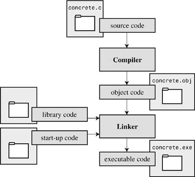

# Introduction to C

### Seven steps of programming

1. Define the program objective
2. Design the program
3. Write the code
4. Compile
5. Run the program
6. Test and debug the program
7. Maintain and modify the program

**Executable File : ** It contains ready-to-run machine language code.

### Compiling and linking
The compiler converts your source code to an intermediate code, and the linker combines this with other code to produce the executable file.

C uses this two-part approach to facilitate the modularisation of programs. You can compile individual modules separately and then use the linker to combine the compiled modules later. That way, if you need to change one module, you don't have to recompile the other ones. Also, the linker combines your program with precompiled library code.

The role of the linker is to bring together these three elements—your object code, the standard startup code for your system, and the library code—and put them together into a single file, the executable file.

